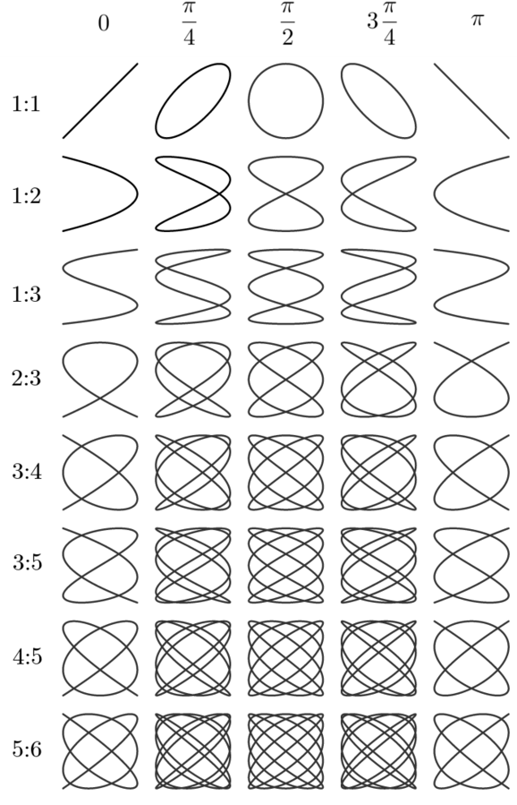

# Lecture tutorial 2E

## LC parallel circuit
`ew06`	

Voltage and current characterized by parallel circuit design
* $V(t) = V_0 \cos(\omega t) = V_0 \cos(2 \pi f t) $
* $V_{L\parallel C} = V_L = V_C$
* $I = I_C + I_L$ (Kirchhoff's node rule)

### Reactance &amp; impedance
In general:
* $Z_C = \frac{1}{j \omega C}$
* $Z_L = j \omega L$

The impedance of the circuit is therefore (remember rule for resistance/impedance in parallel):
$$\frac{1}{Z} = \frac{1}{Z_C} + \frac{1}{Z_L}$$
$$\frac{1}{Z} = \frac{1}{\frac{1}{j \omega C}} + \frac{1}{j \omega L} = j \omega C + \frac{1}{j \omega L} $$
* we perform at trick based on $j^2 = -1$:
$$\frac{1}{j} = \frac{1 \cdot j}{j \cdot j} = \frac{j}{-1} = -j$$
* thus, we can rearrange the inductive part:
$$\frac{1}{Z} = j \omega C - \frac{j}{\omega L} = j (\omega C - \frac{1}{\omega L})$$
* take the reciprocal
$$Z = \frac{1}{j (\omega C - \frac{1}{\omega L})} = \frac{- j}{ (\omega C - \frac{1}{\omega L})}$$

### Phasor diagram
* parallel circuit, so sensible to **use $V_{L\parallel C}$ as reference**
* at **capacitor**: current **$I_C$ lags 90° behind $V_{L\parallel C}$**
* at **inductor**: current **$I_L$ lead 90° before $V_{L\parallel C}$**
* **$I_{L\parallel C}$: vector product of $I_C$ and $I_L$**

### Frequency behavior &amp; (anti-)resonance
$$Z = \frac{1}{j (\omega C - \frac{1}{\omega L})}$$
* **if $\omega C = - \frac{1}{\omega L}$** the denominate goes to zero and therefore, the **impedance to infinity** $\rightarrow$ so-called, **anti-resonance**
* the resonance frequency therefore is:
$$ \omega C - \frac{1}{\omega L} = 0$$
$$ \omega C = \frac{1}{\omega L} $$
$$ \omega^2 C = \frac{1}{L} $$
$$ \omega^2 = \frac{1}{LC} $$
$$ f = \sqrt{\frac{1}{2 \pi LC}} $$

## Lissajous curve
`ew16`
## Lissajous Curve

- A **Lissajous curve** is formed by the **superposition of two perpendicular harmonic oscillations**, typically represented as:
$$x(t) = A \sin(\omega_x t + \delta), \quad y(t) = B \sin(\omega_y t)$$
  - $A$, $B$ as the amplitudes
  - $\omega_x$, $\omega_y$ as the angular frequencies,
  - $\delta$ is the phase difference between the oscillations

- The **ratio of the frequencies** $\frac{\omega_x}{\omega_y}$ determines the **shape and number of loops** (or "knots") in the figure.
  - If the ratio is rational (e.g., 1:1, 2:3), the pattern is **closed** and periodic.
  - If irrational, the figure never exactly closes and densely fills a region.

- The **relative phase** $\delta$ affects the **orientation and symmetry** of the figure:
  - $\delta = 0$ or $\pi$: the curve is symmetric and aligned with the axes
  - $\delta = \frac{\pi}{2}$: the figure is often a ellipse (or circle if amplitudes are equal).
  - Varying $\delta$ smoothly rotates or skews the figure.

- Lissajous figures are often visualized on oscilloscopes using **XY mode**, where one channel drives horizontal deflection and the other vertical deflection.

*from [wikipedia](https://en.wikipedia.org/wiki/File:Lissajous_relaciones.png) under [CC Attribution-ShareAlike 4.0 International](https://creativecommons.org/licenses/by-sa/4.0/deed.en)*

## Microwaves &amp; waveguides
`ew13+ew14+ew15`
* Microwaves propagate inside a waveguide via reflections and interference
* This forms TE (Transverse Electric) and TM (Transverse Magnetic) modes, depending on the field configuration (waveguides do not support TEM (Transverse Electromagnetic) modes).
* Only waves above the cutoff frequency $f_c$ can travel: $f_c = \frac{c}{2a}$ with 
    * $c$ - speed of light
    * $a$ - wider dimension of the waveguide cross-section
* Waveguide confines and efficiently directs the energy with minimal loss.
