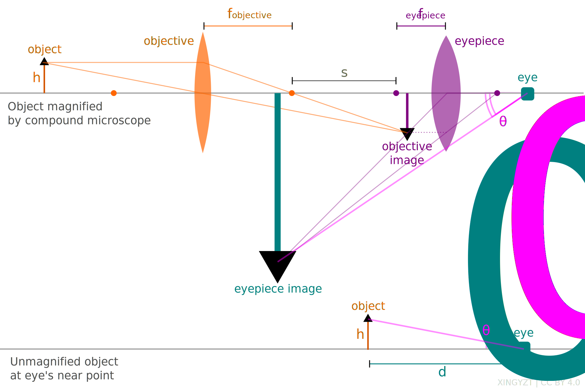
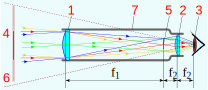
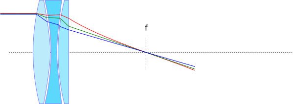
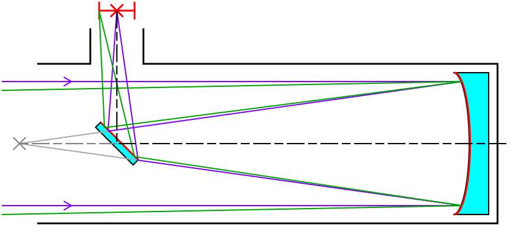
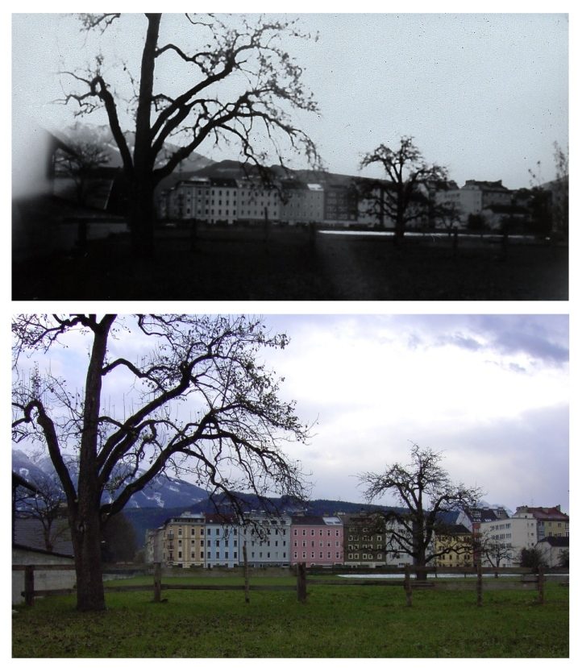

# Lecture tutorial 2F

## Microscopes

### Introduction
* microscopes are optical instruments used to magnify small, close objects that are not visible to the naked eye  
* they enable the observation of fine structural details in biological, material, and other samples

### Components
* objective lens is placed close to the specimen and creates a magnified real image  
* eyepiece lens (ocular) further magnifies the image formed by the objective  
* light source and stage are used to illuminate and support the specimen

### Total magnification
* the total magnification $M$ is the product of the magnifications of the objective and the eyepiece  
* for an objective with focal length $f_o$ and an eyepiece with focal length $f_e$, the approximate total magnification is  
$$
M = \frac{L}{f_o} \cdot \frac{25\,\text{cm}}{f_e}
$$  
* here, $L$ is the tube length and 25 cm is the near point distance for relaxed viewing

### Image formation
* the objective lens forms a real, inverted, and magnified intermediate image of the object  
* the eyepiece lens acts as a magnifier, producing a virtual, enlarged image of the intermediate image  
* the final image is virtual, inverted, and appears at a comfortable viewing distance

*from [wikipedia](https://en.wikipedia.org/wiki/File:Compound_microscope_geometric_optics.svg), [Attribution 4.0 International](//creativecommons.org/licenses/by/4.0/deed.en)*

### Advantages and limitations
* advantages include high magnification and resolution for small-scale structures  
* limitations include the need for precise focusing, illumination, and often sample preparation  
* resolution is limited by diffraction, with a theoretical limit of about $0.61 \lambda / \text{NA}$ where NA is the numerical aperture

## Telescopes

### Introduction
* telescopes are optical instruments designed to magnify distant objects
* they allow observation of celestial bodies and faraway phenomena in greater detail

### Components
* objective lens/mirror collects light from the object and forms a real image
* eyepiece lens magnifies the image formed by the objective

### Angular magnification
* the total angular magnification $M$ of a telescope is defined as the ratio of the angle subtended by the image at the eye to the angle subtended by the object as seen by the unaided eye
* for an objective with focal length $f_o$ and an eyepiece with focal length $f_e$, the magnification is given by
$$
M = \frac{\theta'}{\theta} = \frac{h/f_e}{h/f_o} = \frac{f_o}{f_e}
$$
* with the small angle approximation $ \theta' \approx h/f_e$ and $ \theta \approx h/f_o$

### Image formation
* the image of the first lens (objective) becomes the object for the second lens (eyepiece)
* objective lens forms a real, inverted image near its focal point
* eyepiece lens acts as a magnifying glass producing a virtual, inverted final image

### Types of telescopes

#### Refracting telescopes (Keplerian)
* design uses two converging lenses
* objective lens has a long focal length to collect light and form a real, inverted, diminished image at its focal plane
* eyepiece lens has a short focal length and magnifies the real image
* advantages include simple design and good image quality for small apertures
* disadvantages include heavy, expensive objective lenses and chromatic aberration

*from [wikipedia](https://commons.wikimedia.org/wiki/File:Kepschem-int.svg), [CC0 1.0 Universal](https://creativecommons.org/publicdomain/zero/1.0/deed.en)*

*from [wikipedia](https://en.wikipedia.org/wiki/File:Apochromat.svg), [Attribution-Share Alike 3.0 Unported](//creativecommons.org/licenses/by-sa/3.0/deed.en)*

#### Reflecting telescopes (Newtonian)
* design uses a concave mirror as the objective to collect and focus light
* light reflects off the primary mirror forming a real, inverted image at the focal point
* a secondary flat mirror reflects the image to the side for viewing through an eyepiece
* advantages include absence of chromatic aberration and easier manufacture of large mirrors
* disadvantages include diffraction effects from the secondary mirror and the need for periodic realignment

*from [wikipedia](https://en.wikipedia.org/wiki/File:Newtonian_telescope2.svg), [Attribution-Share Alike 4.0 International](//creativecommons.org/licenses/by-sa/4.0/deed.en)*

## Pinhole Cameras

*from [wikipedia](https://en.wikipedia.org/wiki/File:Pinhole-camera.svg), public domain*

### Introduction
* pinhole cameras are simple optical devices that form images using a tiny aperture instead of a lens  
* they demonstrate basic principles of image formation through rectilinear propagation of light

### Components
* a light-tight box with a small pinhole on one side acts as the aperture  
* an image screen or photographic surface is placed opposite the pinhole inside the box

### Effective focal length
* the effective focal length $f$ is defined as the distance between the pinhole and the image plane  
* this distance determines the image size and sharpness  
* increasing $f$ enlarges the image but reduces brightness and sharpness due to diffraction

### Image formation
* each point on an object emits light in all directions, but only rays passing through the pinhole reach the screen  
* the result is an inverted, real image formed on the image plane  
* no lenses are involved, so no refraction or chromatic aberration occurs

### Image properties
* image is always real, inverted, and reduced or magnified depending on object distance and pinhole-to-screen distance  
* image sharpness improves with a smaller pinhole but brightness decreases  
* very small pinholes cause diffraction, blurring the image

### Advantages and limitations
* advantages include simplicity, low cost, and infinite depth of field  
* limitations include dim images, long exposure times, and limited resolution due to diffraction and small aperture size

*from [wikipedia](https://de.wikipedia.org/wiki/Datei:Lochkamera2.jpg), [GNU-Lizenz für freie Dokumentation](https://en.wikipedia.org/wiki/de:GNU-Lizenz_f%C3%BCr_freie_Dokumentation)*
